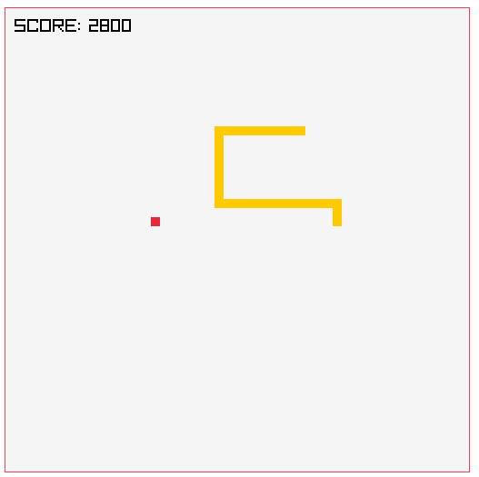
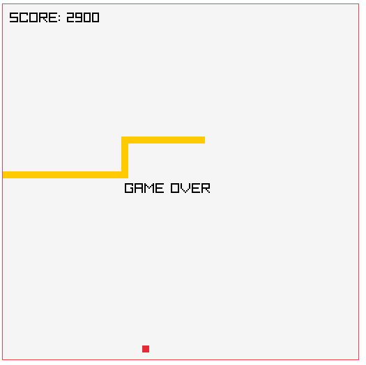

SNAKE
=====

Snake game, I made it as an exercise for C++ and using Raylib.

# Screenshots




# How does it work

It's pretty simple and small ~100 Lines of Code (LoC). consists of one big main function.

It keeps the score, generates food for the snake randomly. and check collisions with the edges and itself.

The game will lock FPS to 10 then increase it 1 FPS everytime the snake eats food.

# Compiling

To compile and run it. make sure you have raylib and clang on your machine. on Archlinux

```shell
# pacman -S raylib clang
```

run the `run` bash script to compile and run it

```shell
$ ./run
```
